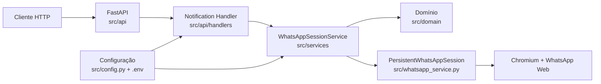
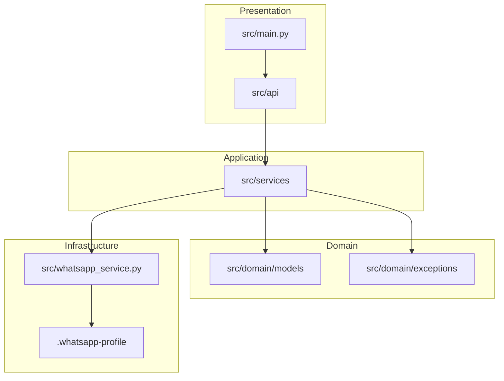
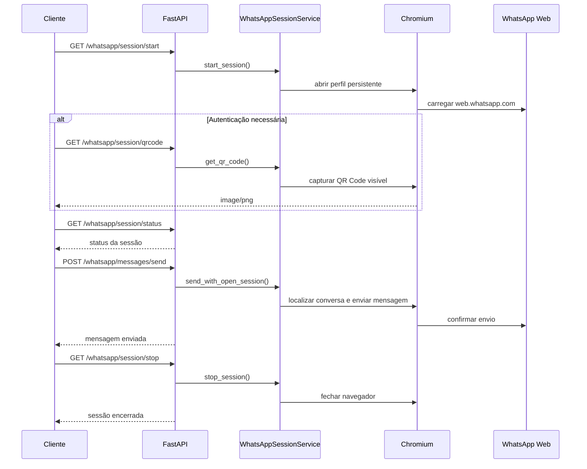

# WhatsApp Notify

API REST para controlar uma sessão persistente do WhatsApp Web e enviar mensagens para contatos ou grupos usando Python, FastAPI e Playwright.

> O projeto reutiliza um perfil persistente do Chromium. Na primeira execução, ou quando a autenticação expirar, é necessário escanear o QR Code do WhatsApp Web.

## Sumário

- [Sobre o Projeto](#sobre-o-projeto)
- [Stack](#stack)
- [Arquitetura](#arquitetura)
- [Fluxo de Funcionamento](#fluxo-de-funcionamento)
- [Estrutura do Projeto](#estrutura-do-projeto)
- [Configuração](#configuração)
- [Execução Local](#execução-local)
- [Implantação na AWS](#implantação-na-aws)
- [Contrato da API](#contrato-da-api)
- [Testes](#testes)
- [Observações Operacionais](#observações-operacionais)

## Sobre o Projeto

| Item | Descrição |
| --- | --- |
| Nome | `whatsapp-notify` |
| Tipo | API REST |
| Objetivo | Enviar mensagens pelo WhatsApp Web a partir de uma sessão persistente |
| Linguagem | Python 3.12+ |
| Framework HTTP | FastAPI |
| Automação Web | Playwright com Chromium |
| Documentação | Swagger UI, ReDoc e OpenAPI JSON |

Funcionalidades principais:

- Iniciar uma sessão persistente do WhatsApp Web.
- Capturar o QR Code da sessão aberta.
- Consultar o status atual da sessão.
- Enviar mensagens para contato ou grupo usando sessão autenticada.
- Encerrar a sessão ativa e fechar o navegador associado.

## Stack

| Tecnologia | Uso |
| --- | --- |
| Python 3.12+ | Linguagem principal |
| FastAPI | API REST e documentação OpenAPI |
| Uvicorn | Servidor ASGI |
| Playwright | Automação do WhatsApp Web |
| python-dotenv | Carregamento de variáveis de ambiente |
| Pytest | Testes automatizados |
| pytest-cov | Cobertura de testes |

## Arquitetura

O projeto segue uma organização inspirada em Clean Architecture, separando a entrada HTTP, os serviços de aplicação, o domínio e a infraestrutura de automação.





Mais detalhes estão em [ARCHITECTURE.md](./ARCHITECTURE.md).

## Fluxo de Funcionamento



## Estrutura do Projeto

```text
src/
|-- api/                         # Rotas, handlers, schemas, respostas e OpenAPI
|   |-- handlers/
|   |-- routers/
|   `-- schemas/
|-- config.py                    # Configuração via ambiente
|-- domain/                      # Modelos e exceções de domínio
|-- logging_config.py            # Configuração de logs
|-- main.py                      # Entry point da aplicação
|-- services/                    # Orquestração de negócio e sessão
`-- whatsapp_service.py          # Automação Playwright e sessão persistente

tests/
|-- test_notification_handler_session.py
|-- test_server_helpers.py
|-- test_services.py
|-- test_whatsapp_routes.py
`-- test_whatsapp_session_service.py
```

## Configuração

Crie o arquivo `.env` com base no `.env.example`:

```env
WHATSAPP_TARGET_NAME='Nome do contato ou grupo'
WHATSAPP_MESSAGE='Mensagem de teste enviada automaticamente'
WHATSAPP_HEADLESS=false
WHATSAPP_PROFILE_DIR=.whatsapp-profile
WHATSAPP_TIMEOUT_SECONDS=60
API_HOST=0.0.0.0
API_PORT=8000
LOG_LEVEL=INFO
```

| Variável | Obrigatória | Descrição |
| --- | --- | --- |
| `WHATSAPP_TARGET_NAME` | Não | Contato ou grupo padrão quando `contact` não for enviado no corpo da requisição. |
| `WHATSAPP_MESSAGE` | Não | Mensagem padrão quando `message` não for enviado no corpo da requisição. |
| `WHATSAPP_HEADLESS` | Não | Controla se o navegador abre em modo headless. Use `false` na primeira autenticação. |
| `WHATSAPP_PROFILE_DIR` | Não | Diretório do perfil persistente do Chromium. |
| `WHATSAPP_TIMEOUT_SECONDS` | Não | Timeout padrão para autenticação, busca e envio. |
| `API_HOST` | Não | Host usado pelo servidor FastAPI. |
| `API_PORT` | Não | Porta usada pelo servidor FastAPI. |
| `LOG_LEVEL` | Não | Nível mínimo de log (`DEBUG`, `INFO`, `WARNING`, `ERROR`). |

`WHATSAPP_TARGET_NAME` e `WHATSAPP_MESSAGE` são obrigatórias apenas quando a requisição de envio não informar `contact` e `message`.

## Execução Local

Crie e ative o ambiente virtual:

```powershell
python -m venv .venv
.\.venv\Scripts\activate
```

Instale as dependências:

```powershell
python -m pip install -e ".[dev]"
```

Instale o Chromium usado pelo Playwright:

```powershell
playwright install chromium
```

Execute a API:

```powershell
python -m main
```

Ou use o comando instalado pelo pacote:

```powershell
whatsapp-notify
```

URLs locais:

| Recurso | URL |
| --- | --- |
| API | `http://localhost:8000` |
| Swagger UI | `http://localhost:8000/docs` |
| ReDoc | `http://localhost:8000/redoc` |
| OpenAPI JSON | `http://localhost:8000/openapi.json` |

## Implantação na AWS

O projeto inclui infraestrutura como código para executar a API em uma única
instância EC2, preservando o processo do Chromium e o perfil autenticado entre
as requisições.

| Componente | Responsabilidade |
| --- | --- |
| `template.yaml` | Provisiona EC2, EBS criptografado, Security Group, IAM, Session Manager e budget via SAM/CloudFormation. |
| `samconfig.local.toml` | Exemplo local dos parâmetros de validação e deploy do SAM. |
| S3 privado | Armazena o ZIP versionado da aplicação usado no bootstrap e nas atualizações. |
| systemd | Executa um único worker da API e reinicia o serviço após falhas ou reboot. |
| Nginx | Atua como proxy reverso para a API. |
| EBS gp3 | Persiste o perfil do Chromium em `/opt/whatsapp-notify/data/.whatsapp-profile`. |

Pré-requisitos: AWS CLI v2, AWS SAM CLI, credenciais AWS configuradas e
permissões para CloudFormation, EC2, IAM, S3, SSM e Budgets. Antes do deploy,
copie `samconfig.local.toml` para `samconfig.toml`, preencha os parâmetros locais
e envie o artefato da aplicação, sem `.env` ou `.whatsapp-profile`, para o bucket
S3 privado.

Valide e implante:

```powershell
sam validate --lint
sam build
sam deploy
```

O primeiro deploy deve ser feito com `sam deploy --guided`. Para homologação,
acesse a API por encaminhamento de porta do AWS Systems Manager Session Manager,
sem publicá-la diretamente. Para produção, configure HTTPS no Nginx e restrinja
o Security Group ao CIDR autorizado.

> O AWS Free Tier não garante gratuidade permanente. EC2, EBS, IPv4 público,
> snapshots, S3 e outros recursos podem gerar cobrança; valide a modalidade e
> os créditos da conta e mantenha alertas de budget ativos.

Consulte o roteiro completo de preparação, deploy, acesso por SSM, atualização,
backup, rollback e remoção de recursos em
[AWS_FREE_TIER_MIGRATION_STEP_BY_STEP.md](./docs/AWS_FREE_TIER_MIGRATION_STEP_BY_STEP.md).

## Contrato da API

### Endpoints

| Método | Endpoint | Descrição |
| --- | --- | --- |
| `GET` | `/whatsapp/session/start` | Abre o navegador e inicia a sessão persistente do WhatsApp Web. |
| `GET` | `/whatsapp/session/qrcode` | Captura o QR Code visível da sessão aberta e retorna `image/png`. |
| `GET` | `/whatsapp/session/status` | Consulta o status atual da sessão sem abrir ou fechar navegador. |
| `POST` | `/whatsapp/messages/send` | Envia mensagem usando uma sessão já aberta e autenticada. |
| `GET` | `/whatsapp/session/stop` | Fecha a sessão ativa e o navegador associado. |

### Iniciar Sessão

```http
GET /whatsapp/session/start?headless=false&timeoutInSecounds=60
```

| Query Param | Tipo | Obrigatório | Descrição |
| --- | --- | --- | --- |
| `headless` | `boolean` | Não | Sobrescreve `WHATSAPP_HEADLESS` nesta abertura de sessão. |
| `timeoutInSecounds` | `integer` | Não | Sobrescreve `WHATSAPP_TIMEOUT_SECONDS` nesta abertura de sessão. |

Resposta:

```json
{
  "status": "ok",
  "message": "Sessão do WhatsApp Web iniciada com sucesso."
}
```

### Capturar QR Code

```http
GET /whatsapp/session/qrcode
```

Retorna uma imagem PNG com o QR Code visível da sessão aberta.

Headers:

| Header | Descrição |
| --- | --- |
| `Content-Type` | `image/png` |
| `X-QRCode-Expires-In-Seconds` | Janela estimada de validade do QR Code, em segundos. |
| `X-QRCode-Expires-At` | Data e hora UTC estimada de expiração do QR Code. |
| `Cache-Control` | `no-store` |

### Consultar Status da Sessão

```http
GET /whatsapp/session/status
```

Exemplo de resposta:

```json
{
  "status": "SESSAO_ABERTA",
  "message": "Sessão do WhatsApp Web aberta.",
  "isOpen": true
}
```

Status possíveis:

| Status | `isOpen` | Significado |
| --- | --- | --- |
| `SESSAO_FECHADA` | `false` | Nenhuma sessão ativa. |
| `INICIANDO_SESSAO` | `false` | Sessão em processo de inicialização. |
| `AGUARDANDO_AUTENTICACAO` | `true` | WhatsApp Web aberto aguardando autenticação. |
| `CARREGANDO_CONVERSAS` | `true` | WhatsApp Web carregando conversas. |
| `SESSAO_ABERTA` | `true` | Sessão autenticada e pronta para envio. |

### Enviar Mensagem

```http
POST /whatsapp/messages/send
Content-Type: application/json
```

Request body:

```json
{
  "contact": "Grupo Teste",
  "message": "Olá pelo WhatsApp Notify"
}
```

| Campo | Tipo | Obrigatório | Descrição |
| --- | --- | --- | --- |
| `contact` | `string` | Não | Nome exato do contato ou grupo. Usa `WHATSAPP_TARGET_NAME` quando ausente. |
| `message` | `string` | Não | Mensagem enviada pelo WhatsApp Web. Usa `WHATSAPP_MESSAGE` quando ausente. |

Resposta:

```json
{
  "status": "enviado",
  "message": "Mensagem enviada com sucesso.",
  "contact": "Grupo Teste",
  "elapsedTimeInSeconds": 3.21
}
```

### Encerrar Sessão

```http
GET /whatsapp/session/stop
```

Resposta:

```json
{
  "status": "ok",
  "message": "Sessão do WhatsApp Web encerrada com sucesso."
}
```

### Padrão de Erro

```json
{
  "error": {
    "code": "SESSAO_FECHADA",
    "message": "A sessão do WhatsApp Web está fechada. Inicie a sessão antes de enviar mensagens."
  }
}
```

Quando aplicável, a resposta inclui os campos inválidos ou ausentes:

```json
{
  "error": {
    "code": "DADOS_OBRIGATORIOS_AUSENTES",
    "message": "Informe 'contact' no corpo da requisição ou configure WHATSAPP_TARGET_NAME no ambiente",
    "fields": ["contact"]
  }
}
```

## Testes

Execute a suíte com cobertura:

```powershell
.\.venv\Scripts\python.exe -m pytest --cov=src --cov-report=term-missing -q
```

Regras de teste:

- Os testes não devem acessar `https://web.whatsapp.com`.
- Use mocks, fakes ou páginas virtuais para simular o comportamento do navegador.
- A cobertura exige 100% dos módulos unit-testáveis em `src`.
- `src/whatsapp_service.py` e entrypoints de execução ficam fora da métrica por dependerem de navegador real ou bootstrap do processo.

## Observações Operacionais

- Os endpoints de sessão mantêm um navegador ativo no processo da API.
- O envio usa sempre uma sessão já aberta; `POST /whatsapp/messages/send` não abre nem fecha navegador.
- Os envios são serializados por processo para evitar disputa pelo mesmo perfil persistente.
- Use apenas um worker por instância quando compartilhar o mesmo `WHATSAPP_PROFILE_DIR`.
- Mudanças na interface do WhatsApp Web podem exigir atualização de seletores em `src/whatsapp_service.py`.
- A automação usa WhatsApp Web diretamente no navegador; não usa bibliotecas não oficiais baseadas em engenharia reversa do WhatsApp.
